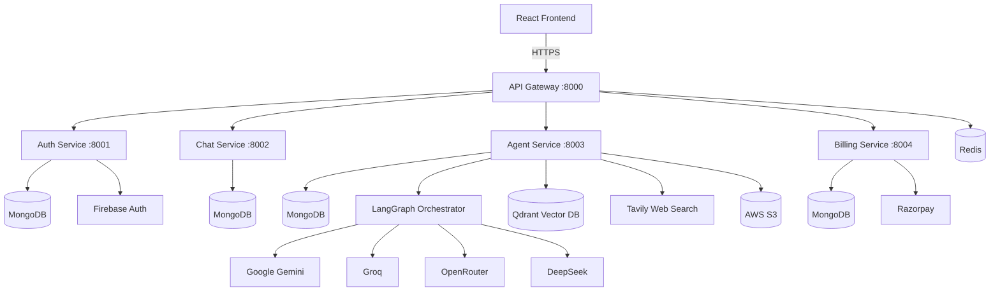

<div align="center">

# 🪷 LotusAi

### A Multi-Agent AI Platform Built on a Microservices Architecture

**Chat • Code Generation • PDF & PPT Generation • Document RAG • Vision • Web Search — powered by multiple LLM providers, orchestrated through LangGraph.**

[](https://react.dev/)
[](https://nodejs.org/)
[](https://www.mongodb.com/)
[](https://redis.io/)
[](https://www.langchain.com/)
[](https://aws.amazon.com/s3/)
[](https://firebase.google.com/)
[](https://www.docker.com/)

</div>

---

## Overview

**LotusAi** is a full-stack, production-style AI assistant platform that goes beyond a single chatbot. It's built as five independent microservices behind a single API gateway, giving it the flexibility to route a user's request to a specialized AI agent depending on what they actually need — a chat reply, a coding solution, a generated PDF report, a full PowerPoint deck, image analysis, or a live web search — all inside one seamless interface.

Rather than relying on a single AI provider, LotusAi's agent layer is model-agnostic: it can call **Google Gemini, Groq, OpenRouter, or DeepSeek** interchangeably, orchestrated through **LangGraph** as a stateful agent graph, with **Qdrant** providing vector search for document-grounded (RAG) conversations.

---

## ✨ Features

- 🤖 **Multi-agent routing** — Auto, Chat, Coding, PDF, PPT, Image, and Search agents, each specialized for its task
- 💬 **Persistent conversations** — full chat history stored and retrievable per user
- 📄 **AI-generated documents** — produces real, downloadable PDF reports and PowerPoint presentations on demand
- 🖼️ **Vision agent** — image understanding and analysis
- 🌐 **Live web search agent** — powered by Tavily, for up-to-date, grounded answers
- 📚 **Document RAG** — upload a PDF and query it conversationally, backed by vector embeddings in Qdrant
- 🔐 **Secure authentication** — Firebase Authentication (Google & GitHub sign-in) verified server-side
- 💳 **Subscription & credits system** — Razorpay-powered billing with plan tiers and usage-based credits
- 🎙️ **Voice input** — browser-based speech-to-text for hands-free prompting
- ⚡ **Rate-limited, cached gateway** — Redis-backed request throttling to protect backend services
- 🗂️ **Cloud file storage** — AWS S3 integration for uploads and generated document delivery

---

## 🏗️ Architecture

LotusAi follows a **microservices architecture** — each concern is an independently deployable Node.js service, unified behind a single API gateway.



Each service owns its own database connection, its own dependencies, and can be scaled, restarted, or redeployed independently — a request to the coding agent doesn't affect billing, and a billing outage doesn't take down chat history.

---

## 🛠️ Tech Stack

### Frontend
| Technology | Purpose |
|---|---|
| **React 19** | UI framework |
| **Redux Toolkit** | Global state management |
| **Vite** | Build tool & dev server |
| **Tailwind CSS 4** | Styling |
| **Framer Motion** | Animations & transitions |
| **Firebase Auth (client)** | Google / GitHub login |
| **Monaco Editor** | In-browser code editor (VS Code's engine) |
| **React Markdown + remark-gfm** | Rich chat message rendering |
| **React Syntax Highlighter** | Code block formatting |
| **Axios** | HTTP client |
| **Razorpay Checkout** | Payment UI |

### Backend — API Gateway
| Technology | Purpose |
|---|---|
| **Express 5** | Web framework |
| **express-http-proxy / http-proxy-middleware** | Request routing to microservices |
| **ioredis + rate-limit-redis** | Distributed rate limiting |
| **Helmet** | Security headers |
| **Morgan** | Request logging |
| **Cookie Parser + CORS** | Session & cross-origin handling |

### Backend — Auth, Chat & Billing Services
| Technology | Purpose |
|---|---|
| **Express 5** | Web framework |
| **MongoDB + Mongoose** | Data persistence |
| **Firebase Admin SDK** | Server-side identity verification |
| **Razorpay SDK** | Payment order creation & signature verification |

### Backend — Agent Service (the AI core)
| Technology | Purpose |
|---|---|
| **LangChain + LangGraph** | Stateful multi-agent orchestration |
| **Google Gemini (@google/genai, @langchain/google-genai)** | LLM provider |
| **Groq (@langchain/groq)** | High-speed LLM inference |
| **OpenRouter (@langchain/openrouter)** | Unified access to multiple model providers |
| **DeepSeek (@langchain/deepseek)** | LLM provider |
| **Qdrant (@langchain/qdrant)** | Vector database for RAG / document search |
| **Tavily (@langchain/tavily)** | Real-time web search for agents |
| **PDFKit** | Programmatic PDF generation |
| **PptxGenJS** | Programmatic PowerPoint generation |
| **pdf-parse** | PDF text extraction for RAG ingestion |
| **AWS SDK (S3 Client + Presigner)** | File storage & secure signed URLs |
| **Multer** | File upload handling |

### Infrastructure & DevOps
| Technology | Purpose |
|---|---|
| **Docker** | Containerized Redis |
| **Redis** | Caching & rate-limiting store |
| **MongoDB Atlas** | Managed cloud database |
| **AWS (EC2, S3, IAM)** | Compute & storage hosting |
| **Nginx** | Reverse proxy / SSL termination |
| **PM2** | Node.js process management in production |

---

## 📁 Project Structure

```
LotusAi/
├── frontend/                  # React + Vite client
│   └── src/
│       ├── components/        # Chat UI, Sidebar, Billing drawer, etc.
│       ├── pages/
│       └── features/          # Redux slices & API calls
│
└── backend/
    ├── gateway/                # API Gateway (routing, auth middleware, rate limiting)
    ├── shared/redis/           # Shared Redis client
    └── services/
        ├── auth/               # Firebase-verified authentication
        ├── chat/               # Conversation & message persistence
        ├── billing/            # Razorpay subscriptions & credits
        └── agent/              # Multi-agent AI engine (LangGraph)
            ├── agents/         # Chat, Coding, PDF, PPT, Vision, Search agents
            └── graph/          # LangGraph routing logic
```

---

## 🚀 Getting Started

### Prerequisites
- Node.js (v20+)
- Docker Desktop (for Redis)
- Accounts for: MongoDB Atlas, Firebase, Google AI Studio, Groq, OpenRouter, Tavily, AWS, Qdrant Cloud, Razorpay

### 1. Clone the repository
```bash
git clone https://github.com/pnkmaurya9307/LotusAi.git
cd LotusAi
```

### 2. Start Redis
```bash
cd backend
docker compose up -d
```

### 3. Install dependencies
```bash
cd backend && npm install
cd gateway && npm install
cd ../services/auth && npm install
cd ../chat && npm install
cd ../agent && npm install
cd ../billing && npm install
cd ../../../frontend && npm install
```

### 4. Configure environment variables
Each service has its own `.env` file — see `.env.example` in each directory for the required keys (MongoDB URI, Firebase config, LLM API keys, AWS credentials, Qdrant, Razorpay).

### 5. Run each service
```bash
# In separate terminals
cd backend/services/chat && npm run dev      # :8002
cd backend/services/auth && npm run dev      # :8001
cd backend/services/billing && npm run dev   # :8004
cd backend/services/agent && npm run dev      # :8003
cd backend/gateway && npm run dev             # :8000
cd frontend && npm run dev                    # :5173
```

Visit `http://localhost:5173` 🎉

---

## 🔐 Environment Variables

| Service | Required Variables |
|---|---|
| `frontend` | `VITE_FIREBASE_API_KEY`, `VITE_SERVER_URL`, `VITE_RAZORPAY_KEY` |
| `gateway` | `PORT`, `REDIS_URL`, `AUTH_SERVICE`, `CHAT_SERVICE`, `AGENT_SERVICE`, `BILLING_SERVICE` |
| `auth` | `PORT`, `MONGODB_URL`, `FRONTEND_URL` + `serviceAccount.json` (Firebase Admin credentials) |
| `chat` | `PORT`, `MONGODB_URL` |
| `agent` | `PORT`, `MONGODB_URL`, `GOOGLE_API_KEY`, `GROQ_API_KEY`, `OPENROUTER_API_KEY`, `TAVILY_API_KEY`, `AWS_ACCESS_KEY_ID`, `AWS_SECRET_ACCESS_KEY`, `AWS_REGION`, `AWS_BUCKET_NAME`, `QDRANT_URL`, `QDRANT_API_KEY` |
| `billing` | `PORT`, `MONGODB_URL`, `RAZORPAY_KEY_ID`, `RAZORPAY_KEY_SECRET` |

> ⚠️ Never commit real `.env` files or `serviceAccount.json` — they're excluded via `.gitignore`.

---

## 📌 Roadmap

- [ ] Streaming token-by-token responses
- [ ] Multi-modal document uploads (DOCX, XLSX)
- [ ] Team/workspace collaboration
- [ ] Usage analytics dashboard

---

## 📄 License

This project is licensed under the [MIT License](LICENSE).

---

<div align="center">

**Built by [Pnkmaurya9307]** — feel free to ⭐ this repo if you find it interesting!

</div>